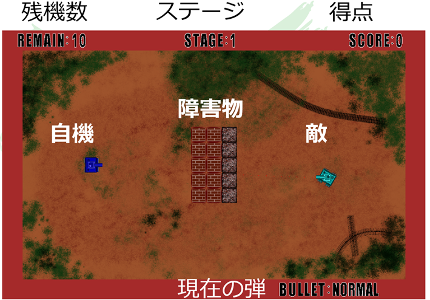
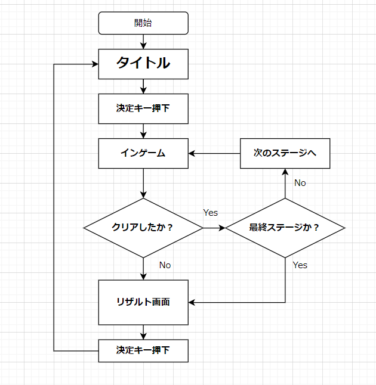
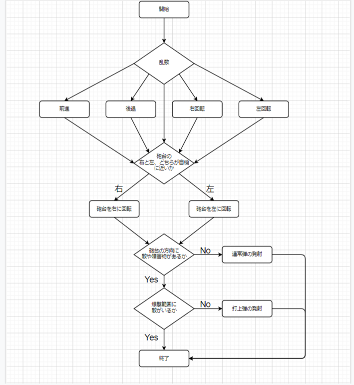

学部2年生の時に作成した戦車ゲームです。
Javaで製作しています。

# 遊び方
1. リポジトリをクローン / ファイルをダウンロード
2. Javaをインストール(JDK19.0.2では、動作確認済み)
3. システム環境変数のPathにJavaの実行ファイルのPathを追加
4. TankGame.javaをコンパイル
```
javac TankGame.java
```
5. 実行

```
java TankGame
```

# 概要
- 2種類の弾や爆弾を使いこなし、敵を倒していく見下ろし型の戦車ゲーム
- 全8ステージ

# ゲーム画面


# 操作方法
| アクション | 入力 |
| --- | --- |
| 前進 / 後退 | 上矢印キー / 下矢印キー |
| 右回転 / 左回転 | 右矢印キー / 左矢印キー |
| 砲台の右回転 / 左回転 | Cキー / Zキー |
| 弾の発射 | Spaceキー |
| 弾の切り替え(通常弾 / 打上弾) | Xキー |
| 爆弾の設置 | Vキー |
| ポーズ | Pキー |
| 終了 | Escapeキー |
| 残機を99にする | 秘密 |


# 仕様
## ゲームのフロー


## 弾・爆弾について
- **通常弾** :  まっすぐ飛ぶ弾。壁や障害物に反射すると一度跳ね返る。自機・敵機ともに画面内に5発発射できる。通常弾同士が衝突すると相殺する。

- **打上弾** : 弾を上に打ち上げる。着弾すると大爆発する。自機は飛ぶ距離が固定だが、敵機は自機の場所に着弾するように速さを変えて発射する。自機は画面内に1発、敵機は2発発射できる。レンガブロックを壊すことが出来る。

- **爆弾** : 一定時間経つか、弾や爆弾に当たると爆発する。自機のみ設置が可能で、画面内に3個設置できる。レンガブロックを壊すことが出来る。

## 障害物について
- **レンガブロック** : 打上弾や爆弾によりこわすことができる
- **鉄ブロック** : 壊すことができない

## 敵機について
- **緑色** : 一番弱い敵。移動速度が遅く、通常弾のみ撃つ。
- **茶色** : 動かないが、打上弾を撃つ。放置すると厄介。
- **白色** : 一定時間透明になる。通常弾のみ撃つ。移動速度が少し速く、弾のディレイタイムも短い。
- **紫色** : 一番強い敵。反射しない高速の通常弾を撃つ。通常弾が当たらないと判断すると打上弾を撃つ。移動速度が速く、弾のディレイタイムも短い。

## 敵機のフロー
図は紫色の敵機のフローを表す。


## クラスの役割
- **TankGame** : スレッド
- **GameMaster** : 入力受付、画面遷移、ゲーム画面の外側の描画
- **StageCreate** : 当たり判定処理、機体などの描画、ステージの描画
- **Fighter** : 自機
- **FighterBullet** : 自機の通常弾
- **FighterFlyBullet** : 自機の打上弾
- **FighterBomb** : 自機の爆弾
- **Enemy** : 敵機
- **EnemyBullet** : 敵機の通常弾
- **EnemyFlyBullet** : 敵機の打上弾
- **Obstacle** : 障害物